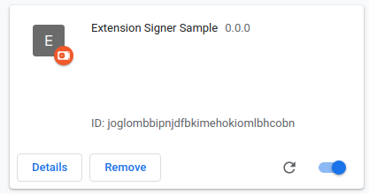
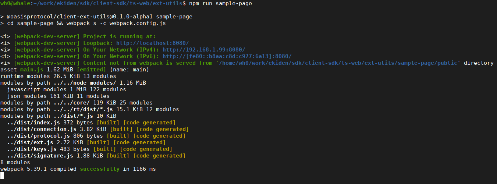

# Getting started

## Building an extension

**The sample extension.**
Take a look at the sample code for the extension side of the overall DApp
interface and signer interface.
That's in [sample-ext/src/index.js](../sample-ext/src/index.js).
It's integrated into the extension here in
[manifest.json](../sample-ext/manifest.json#L8), as a "web accessible
resource."

At a high level, the sample extension calls an `oasisExt.ext.ready` function
with a bunch of
callbacks, which the `oasisExt` library will call when the DApp makes
requests.
The sample extension handles these entirely within a little `iframe` that a
DApp will embed, but it's fine to relay messages to a background page or
otherwise communicate with other parts of the extension.

There's a webpack build step for the sample extension.
Run `npm run sample-ext` in `client-sdk/ts-web/ext-utils` to do that step.
Then, load the `client-sdk/ts-web/ext-utils` directory as an unpacked
extension.

**Trying your own extension.**
Integrate a similar "web accessible resource" page into your extension and
implement the extension side of the signer interface.
To try it out with the sample DApp page, do the following:

1. Get your extension ID from [chrome://extensions](chrome://extensions), e.g.
   `joglombbipnjdfbkimehokiomlbhcobn` here:

   

2. Build the [sample-page](../sample-page) webpack project.
   You should be able to use `npm run sample-page` in
   `client-sdk/ts-web/ext-utils` in a checkout of this repo to build it and
   serve it locally.

   

3. Open the URL
   `http://localhost:8080/?ext=chrome-extension://(your extension id)` in the
   browser.

   

   This should ask the extension (1) to list the keys, (2) to sign a consensus
   staking transfer, and (3) to sign a runtime accounts transfer.
